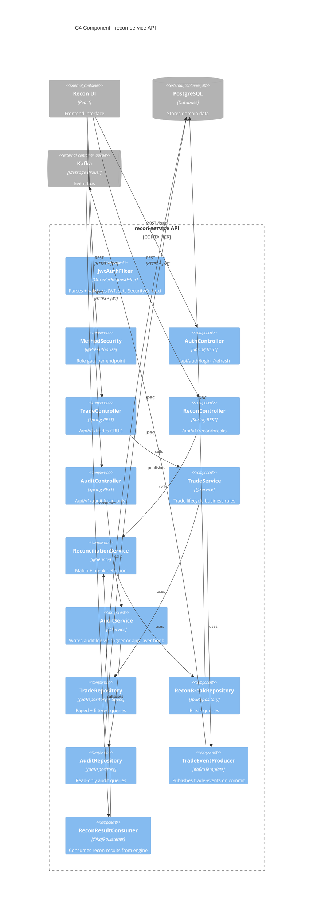

```mermaid
C4Component
title C4 Component - recon-service API

Container_Ext(ui, "Recon UI", "React", "Frontend interface")
ContainerDb_Ext(db, "PostgreSQL", "Database", "Stores domain data")
ContainerQueue_Ext(kafka, "Kafka", "Message Broker", "Event bus")

Container_Boundary(api, "recon-service API") {
    
    Component(jwt_filter, "JwtAuthFilter", "OncePerRequestFilter", "Parses + validates JWT, sets SecurityContext")
    Component(method_sec, "MethodSecurity", "@PreAuthorize", "Role gate per endpoint")

    Component(auth_ctrl, "AuthController", "Spring REST", "/api/auth/login, /refresh")
    Component(trade_ctrl, "TradeController", "Spring REST", "/api/v1/trades CRUD")
    Component(recon_ctrl, "ReconController", "Spring REST", "/api/v1/recon/breaks")
    Component(audit_ctrl, "AuditController", "Spring REST", "/api/v1/audit (read-only)")

    Component(trade_svc, "TradeService", "@Service", "Trade lifecycle business rules")
    Component(recon_svc, "ReconciliationService", "@Service", "Match + break detection")
    Component(audit_svc, "AuditService", "@Service", "Writes audit log via trigger or app-layer hook")

    Component(trade_repo, "TradeRepository", "JpaRepository + Specs", "Paged + filtered queries")
    Component(recon_repo, "ReconBreakRepository", "JpaRepository", "Break queries")
    Component(audit_repo, "AuditRepository", "JpaRepository", "Read-only audit queries")

    Component(trade_prod, "TradeEventProducer", "KafkaTemplate", "Publishes trade-events on commit")
    Component(recon_cons, "ReconResultConsumer", "@KafkaListener", "Consumes recon-results from engine")
}

Rel(ui, auth_ctrl, "POST /login", "HTTPS")
Rel(ui, trade_ctrl, "REST", "HTTPS + JWT")
Rel(ui, recon_ctrl, "REST", "HTTPS + JWT")
Rel(ui, audit_ctrl, "REST", "HTTPS + JWT")

Rel(trade_ctrl, trade_svc, "calls")
Rel(recon_ctrl, recon_svc, "calls")
Rel(audit_ctrl, audit_svc, "calls")

Rel(trade_svc, trade_repo, "uses")
Rel(recon_svc, recon_repo, "uses")
Rel(audit_svc, audit_repo, "uses")
Rel(trade_svc, trade_prod, "uses")

Rel(trade_repo, db, "JDBC")
Rel(recon_repo, db, "JDBC")
Rel(audit_repo, db, "JDBC")

Rel(trade_prod, kafka, "publishes")
Rel(kafka, recon_cons, "consumes")
Rel(recon_cons, recon_svc, "calls")
```