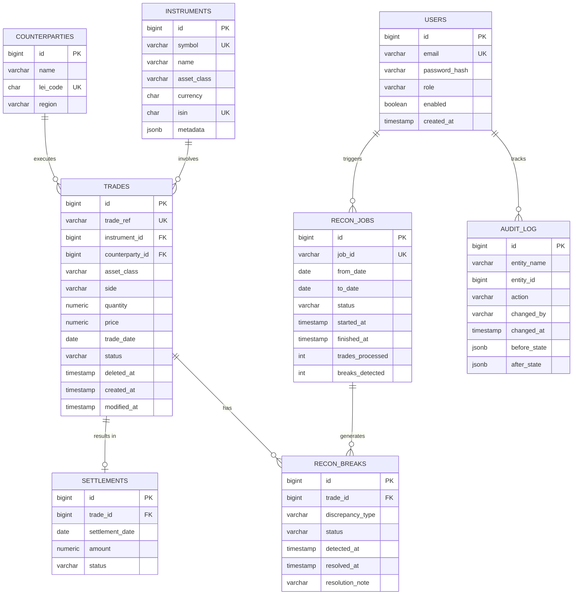

```mermaid
erDiagram
    %% TICKET-ADV009: INSTRUMENTS.metadata
    %% TICKET-ADV007: TRADES.trade_date (PARTITION KEY), TRADES.deleted_at (soft-delete)
    
    COUNTERPARTIES ||--o{ TRADES : "executes"
    INSTRUMENTS ||--o{ TRADES : "involves"
    TRADES ||--o| SETTLEMENTS : "results in"
    TRADES ||--o{ RECON_BREAKS : "has"
    RECON_JOBS ||--o{ RECON_BREAKS : "generates"
    USERS ||--o{ RECON_JOBS : "triggers"
    USERS ||--o{ AUDIT_LOG : "tracks"

    COUNTERPARTIES {
        bigint id PK
        varchar name
        char lei_code UK
        varchar region
    }
    
    INSTRUMENTS {
        bigint id PK
        varchar symbol UK
        varchar name
        varchar asset_class
        char currency
        char isin UK
        jsonb metadata
    }
    
    TRADES {
        bigint id PK
        varchar trade_ref UK
        bigint instrument_id FK
        bigint counterparty_id FK
        varchar asset_class
        varchar side
        numeric quantity
        numeric price
        date trade_date
        varchar status
        timestamp deleted_at
        timestamp created_at
        timestamp modified_at
    }
    
    SETTLEMENTS {
        bigint id PK
        bigint trade_id FK
        date settlement_date
        numeric amount
        varchar status
    }
    
    RECON_JOBS {
        bigint id PK
        varchar job_id UK
        date from_date
        date to_date
        varchar status
        timestamp started_at
        timestamp finished_at
        int trades_processed
        int breaks_detected
    }
    
    RECON_BREAKS {
        bigint id PK
        bigint trade_id FK
        varchar discrepancy_type
        varchar status
        timestamp detected_at
        timestamp resolved_at
        varchar resolution_note
    }
    
    USERS {
        bigint id PK
        varchar email UK
        varchar password_hash
        varchar role
        boolean enabled
        timestamp created_at
    }
    
    AUDIT_LOG {
        bigint id PK
        varchar entity_name
        bigint entity_id
        varchar action
        varchar changed_by
        timestamp changed_at
        jsonb before_state
        jsonb after_state
    }
```